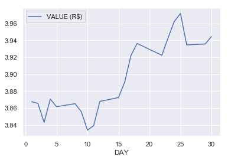

Data Visualization
======================================

Although data visualization is not the main purpose of Ipeadatapy package, one of ipeadatapy's dependencies (pandas) allows plots. Because ipeadatapy is a package related to time series, graphic representations are very important. Thus, we consider a good idea to include the pandas' ``plot()`` function here in our documentation. It is good to have knowledge of the possibility of plotting the time series directly trough Python. Let's do an example by plotting the data of GM366_ERC366 time series for April, 2019: 

.. code:: ipython3

    ipeadatapy.timeseries("GM366_ERC366", year=2019, month=4).plot("DAY", "VALUE (R$)")

Note that the ``plot()`` function parameters are, respectively, the x and y axis of the graph. These parameters must match the column titles of the desired data in the ``timeseries()`` data frame. The tip for correctly filling these parameters is to first run the ``timeseries()`` function alone for your desired time series, check the column names to, then, use these column titles as parameters for the ``plot()`` function.